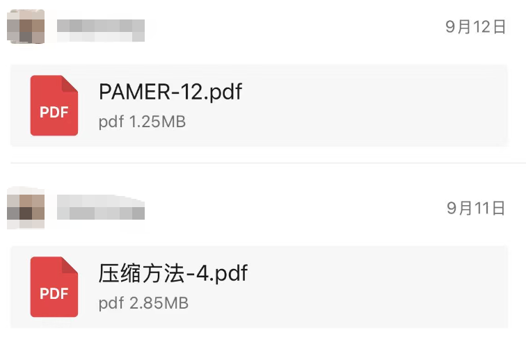

# 作者声明

[English](AUTHORS_STATEMENT.en.md) · [返回总首页](README.zh-CN.md)

本页集中保存各项目的作者声明。以下为作者提供的研究定位与时间线陈述；具体适用项目分别列出，不能将某一项目的完稿日期套用到其他项目。

## TierSense-Compress 与 TierSense-Memory-Decide

> [!IMPORTANT]
> **作者声明｜独立技术路线与研究时间线**
>
> 我们深表遗憾在这个时代，发表工作竟要澄清自己的工作是什么时候开始做的。但是我们依旧要做。
>
> 我们郑重声明：本方法及文章在**北京时间 2026 年 9 月 14 日之前已完稿（有微信截图证明，见文末）**，Jev 出现的时间为 **2026 年 9 月 15 日**。这是我们投入约半年、才终于对外发布的工作，绝不是在 Jev 出现后几天内用 AI 快速拼凑出来的文章。如果想了解具体时间线，欢迎与该账号本人联系。
>
> **本方法与 Jev 采用完全不同的技术路线，具有自己的机理发现。我们认为这是独立技术路线上的超越，而非对 Jev 的复刻或几天内的追随。**这里表达的是作者对原创性与技术路线的判断，不是宣称已经公布了覆盖所有任务的性能优越性证明。
>
> 我们反对以“auto research”之名快速拼凑、缺乏实质研究的内容，也不赞同仅凭发布时间，就给认真投入的工作贴上这样的标签。我们始终希望为社区带来真正的贡献，也认可 AI 辅助研究能够产出高质量成果；但我们不希望这项投入心血完成的方法与文章，在未经认真了解的情况下，被简单归为“自动水文”。
>
> 与此同时，我们理解大家对研究质量的担忧，也很高兴有人愿意站出来发声、维护有价值的学术讨论。我们希望与您一道，做出并发表真正有价值的工作，让认真研究得到认真对待，而不是让长期投入的成果在一夜之间被轻率地判为“水文”。如果您对此感兴趣，欢迎加入官方交流群，与我们一起交流、探索，开展更多有趣且扎实的研究。
>
> 欢迎您使用我们的工作，也欢迎您提出宝贵意见。欢迎质疑、复现，也欢迎大家多多交流。

## TierSense-Score

> [!IMPORTANT]
> **作者声明｜独立技术路线与研究时间线**
>
> 我们深表遗憾在这个时代，发表工作竟要澄清自己的工作是什么时候开始做的。但是我们依旧要做。
>
> 我们郑重声明：本方法已开发半年时间，Jev 出现的时间为 **2026 年 9 月 15 日**。这是我们投入约半年、才终于对外发布的工作，绝不是在 Jev 出现后几天内用 AI 快速拼凑出来的方法。如果想了解具体时间线，欢迎与该账号本人联系。
>
> 本方法与 Jev 采用完全不同的技术路线，具有自己的机理发现。我们认为这是独立技术路线上的超越，而非对 Jev 的复刻或几天内的追随。
>
> 我们反对以“auto research”之名快速拼凑、缺乏实质研究的内容，也不赞同仅凭发布时间，就给认真投入的工作贴上这样的标签。我们始终希望为社区带来真正的贡献，也认可 AI 辅助研究能够产出高质量成果；但我们不希望这项投入心血完成的方法与文章，在未经认真了解的情况下，被简单归为“无意义的跟随性研究”。
>
> 与此同时，我们理解大家对研究质量的担忧，也很高兴有人愿意站出来发声、维护有价值的学术讨论。我们希望与您一道，做出并发表真正有价值的工作，让认真研究得到认真对待，而不是让长期投入的成果在jev出现后一夜之间被轻率地判为“无意义的研究”。如果您对此感兴趣，欢迎加入官方交流群，与我们一起交流、探索，开展更多有趣且扎实的研究。
>
> 欢迎您使用我们的工作，也欢迎您提出宝贵意见。欢迎质疑、复现，也欢迎大家多多交流。

## 项目介绍

**在 Agent 每次调用模型前，获得当前任务的难度信号。**

TierSense-Score 接收完整问题或 Agent 当前消息历史，返回五路特征难度分 `domain1–domain5` 和综合 `score`。你可以展示任务难度、观察执行过程中的分数变化，也可以将分数用于自己的模型路由策略。

两种使用方式：直接评估一个问题；或在 Agent 入口保存原始任务，每轮结合上下文评分。

## 功能特性

- **单问题评分：**直接提交完整问题文本。
- **逐步感知：**内部以任务和最近两个 step 构建评分状态。
- **五路特征分：**`domain1–domain5` 各为 0–2。
- **综合难度分：**返回经过标定的 0–10 分数。
- **理解工具上下文：**按调用 ID 关联工具调用与结果。
- **接入 Agent：**支持提交 Chat、Responses、Anthropic 消息历史与原始任务。

适用于代码助手、办公自动化、数学问题、多轮对话与工具任务。

## 快速开始

在 [TierSense 平台](https://tierflow.cn/tiersense) 获取 API Key，调用官网接口地址：

```text
POST https://tierflow.cn/tiersense/v1/score
```

```bash
curl "https://tierflow.cn/tiersense/v1/score" \
  -H "Authorization: Bearer YOUR_API_KEY" \
  -H "Content-Type: application/json" \
  -d '{
    "model": "TierSense",
    "messages": "修复多分类报表，处理同分与未知标签并添加测试。"
  }'
```

该问题在 2026-09-22 公网测试中的实际返回：

```json
{
  "feature_scores": {
    "domain1": 1.138822513813567,
    "domain2": 0.30560258244498567,
    "domain3": 1.2662245543458972,
    "domain4": 1.0611952851875979,
    "domain5": 0.0
  },
  "score": 2.9608480135599775
}
```

| 字段 | 范围 | 含义 |
| --- | --- | --- |
| feature_scores.domain1–domain5 | 各 0–2 | 五路特征难度分 |
| score | 0–10 | 综合难度分 |

总分经过内部加权与标定，不是五路直接相加，也不是任务成功率。

### Python

```bash
python3 -m pip install requests
```

```python
import os
import requests

response = requests.post(
    "https://tierflow.cn/tiersense/v1/score",
    headers={"Authorization": "Bearer " + os.environ["TIERSENSE_API_KEY"]},
    json={
        "model": "TierSense",
        "messages": "修复多分类报表，处理同分与未知标签并添加测试。"
    },
    timeout=(10, 120),
)
response.raise_for_status()
result = response.json()
print(result)
```

### JavaScript（服务端）

```javascript
// 在服务端调用，将 API Key 保存在环境变量中。
const response = await fetch(
  "https://tierflow.cn/tiersense/v1/score",
  {
    method: "POST",
    headers: {
      Authorization: "Bearer " + process.env.TIERSENSE_API_KEY,
      "Content-Type": "application/json"
    },
    body: JSON.stringify({
      model: "TierSense",
      messages: "修复多分类报表，处理同分与未知标签并添加测试。"
    })
  }
);
if (!response.ok) throw new Error("判断请求失败");
const result = await response.json();
console.log(result);
```

## 接入流程

```text
用户输入问题 → 保存 task
                  ↓
当前 messages + task → TierSense-Score → 本轮难度分数
                  ↓
             Agent 调用主模型
                  ↓
             执行工具、更新历史
                  └→ 下一轮再次评分
```

在用户输入入口保存原始问题，每次模型调用前提交 `task` 和当前非空 `messages`：

```json
{
  "model": "TierSense",
  "task": "修复登录接口的并发问题，并补充回归测试。",
  "messages": [
    {"role": "user", "content": "修复登录接口的并发问题，并补充回归测试。"},
    {"role": "assistant", "content": "已定位共享状态，准备补充回归测试。"}
  ]
}
```

分数单独记录，Agent 继续使用原始消息历史。[使用指南](docs/usage.md) 提供 Python 接入方法与原生工具消息示例。

## 文档

- [使用指南](docs/usage.md)：输入格式、返回结果、Python 调用与 Agent 接入。
- [English usage guide](docs/usage.en.md).
- [TierSense-Compress](https://github.com/wangmingxuan666/Tiersense-Compress)：历史压缩决策配套项目。

本仓库提供托管 API 文档与接入示例，暂不包含模型权重和自部署推理服务源码。

---

## 加入社区

<p align="center">
  <a href="https://tierflow.cn"></a>
</p>

<p align="center">来自 TierFlow 团队 · 欢迎交流与合作</p>

扫描二维码，加入官方交流群。


## 研究时间线截图

以下为作者提供的时间线材料，供上述适用声明参照。具体研究时间线请与该账号本人联系。


