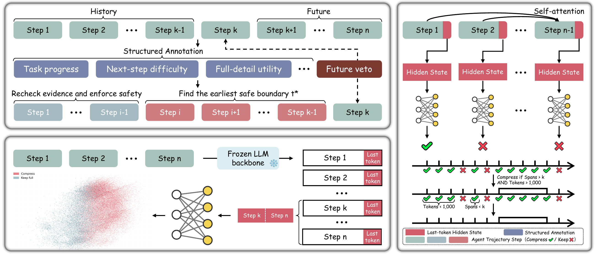

# 方法说明

[English](method.en.md) | [简体中文](method.md) · [返回首页](README.zh-CN.md) · [使用指南](usage.md)

## 1. 判断目标



[查看原始框架图 PDF](../../assets/statecomp-framework.pdf)

在 Agent 下一次生成之前，给定当前可见上下文，判断已有步骤中哪些适合用摘要替代。

一个步骤由一个 assistant 消息及其对应的全部工具结果组成。system、developer、user 消息不作为待替换的步骤。已有摘要也可以作为一个可见步骤参与后续判断。

TierSense-Compress 返回建议和候选片段，不在服务内生成摘要，也不自动修改调用方的会话。

## 2. 任务与消息解析

显式提供的非空 `task` 优先。没有提供时，从支持的原始用户输入或当前上下文首轮任务块中提取；CodeBuddy 的 `user_query` 包装等由提取层处理。不能取得任务时，需要接入方补充 `task`，不拿 assistant 输出冒充用户问题。

接入不同框架时，先将当前历史转换为统一的 role/content/tool_calls/tool_call_id 消息格式，保留索引映射。原生任务提交事件的解析与当前历史消息的转换是两件事。

后续用户要求仍保留在主 Agent 上下文中。当前评分模板没有为所有后续用户补充单独建立分区，不能将它理解为全量上下文无损编码。

## 3. 状态表示

### 紧凑主输入

原版评分模板包含：

| 分区 | 内容 |
| --- | --- |
| Original Task | 原始任务，合并空白后最多 1500 字符 |
| Previous Input | 倒数第二个 assistant 块的正文及工具信息 |
| Previous Output | 最近 assistant 正文，最多 1500 字符 |
| Previous Tool Calls | 最近工具调用，每项 arguments 最多 500 字符 |
| Previous Tool Results | 最近工具结果，每条最多 800 字符 |

Previous Input 的正文最多 1500 字符。加入聊天模板后，主输入最多使用前 4096 tokens。该长度是单次特征提取的预算，不是整个 HTTP 请求或摘要输出的长度上限。

### 隐藏向量与较早历史

当前方法使用冻结的 **Qwen2.5-7B-Instruct**，提取第 21 层 token 隐藏状态的均值，得到 3584 维向量。

1. 将 assistant 和工具结果拆成历史块。
2. 排除最近两块，以较早历史作为 BM25 候选。
3. 使用最后一个历史块的文本检索，选取最多三个相关块。
4. 分别编码选中的块；块超出 4096 tokens 时使用前 2048 与后 2048 tokens。
5. 将隐藏向量与相关分数、排名、步骤距离等元数据一起送入状态编码器。

BM25 的 Top3 用于评分模型的内部特征选择，不会将检索原文额外追加给主 Agent，也不表示只判断这三个块是否压缩。排除最近两块仅针对 BM25 候选池，不是强制保留最近两步。

### Late interaction

主向量和历史块向量分别投影到 256 维，再通过相似度加权池化、逐维交互和差值特征聚合为 512 维状态表示。这里是块级向量交互，不是全量 token 两两交互。

隐藏向量和状态表示可缓存复用。缓存减少重复特征计算，不提供外部会话记忆；被调用方删掉的历史不会由 API 恢复。一次请求可能需要编码多个历史前缀，并不等于一次模型前向。

## 4. 历史—当前状态配对

对第 i 个可见历史步骤：

```text
m_i = 生成步骤 i 之前的可见前缀状态
q_k = 当前完整可见上下文的状态
p_i = sigmoid(配对分类器(m_i, q_k, m_i × q_k, |m_i − q_k|))
```

分类器比较历史状态与当前状态的关系，输出摘要化建议。历史前缀从此次提交的可见消息中重建；已经用摘要替换的原始历史不会被还原。

服务当前内部判断阈值为 0.73。公开逐步结果主要使用 `should_compress` 与 `confidence`；置信度是当前类别的支持分，不是经过保证的正确率。调用方用 `options.confidence_threshold` 选择采用哪些建议，不改变内部分类阈值。

轻量网络的训练采用分类损失、监督对比学习与 full-context 教师蒸馏的组合；冻结骨干用于提取特征。方法效果需要结合具体任务、摘要模型和上下文回填方式评估。

## 5. 从建议到执行

执行策略按以下顺序运行：

```text
检查间隔 → should_compress 与置信度筛选 → 连续分段
         → 每段分别检查 steps、tokens → 返回可执行片段
```

同时设置 span 与 min_tokens 时，必须在同一片段内同时满足：

```text
片段步数 > span 且片段 tokens > min_tokens
```

保留步骤、不达标步骤、user/system/developer 消息会分隔候选片段。用户消息插入工具调用与结果之间时，该交错工具步骤保留，不进入可执行片段。

不同片段不合并计数。`span` 是最小连续长度门槛，不是每批最多选择几步。

## 6. 摘要与继续执行

调用方使用同一份上下文快照，按 `message_indices` 提取每个可执行片段，生成摘要后更新会话。摘要的模型、内容格式和存放位置由调用方决定。

原位替换是一种直接的接入方式：在片段第一条消息位置放一条 assistant 摘要，只移除返回索引指定的消息。保留用户要求和系统约束，保持工具调用与结果成对。保存更新后的上下文，并用于下一次主模型调用和下一次评分。

这三个环节应分别理解：**模型建议压缩、片段满足执行条件、摘要生成并完成回填**。接口返回成功不等于摘要已经生成，也不代表任务已经完成。
